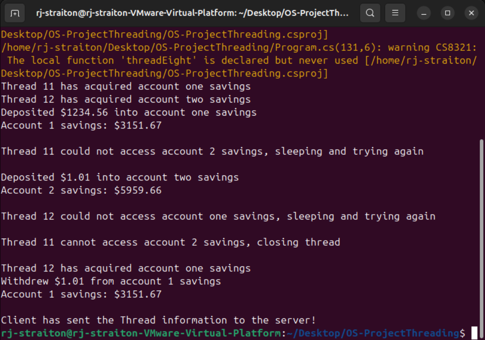
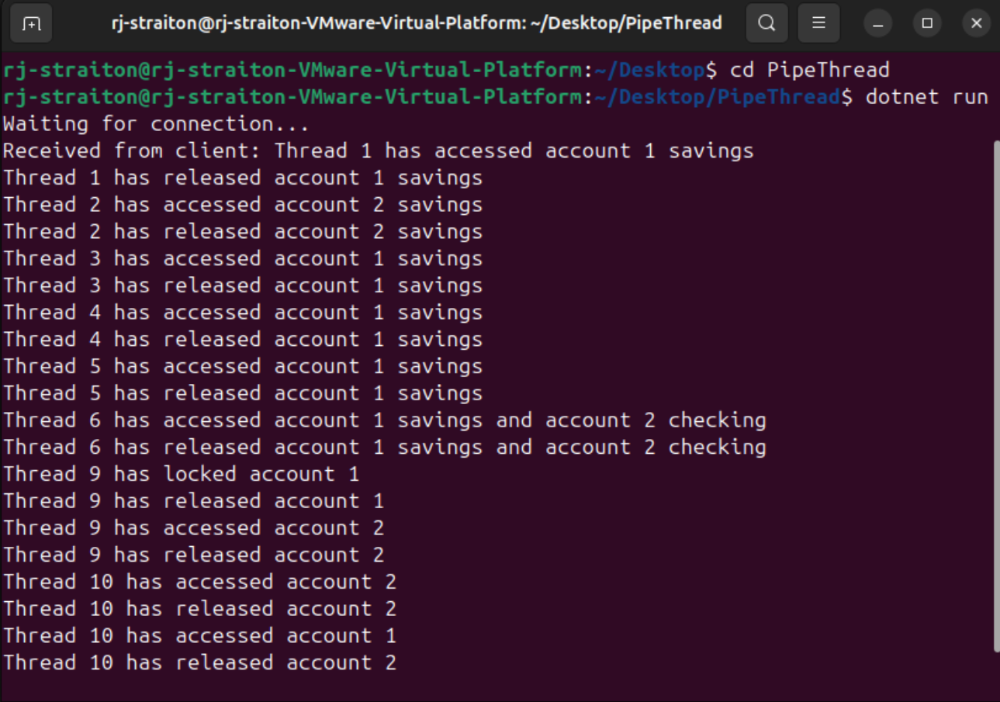

# Multi-Threaded Programming and Inter-Process Communication

Welcome to the project repository for my Multi-Threaded Programming and IPC project. Here you will find all the source code for this project. This project aimed at showcasing multi-threaded programming, thread safety, deadlock prevention, and deadlock recovery.
This project was developed in a virtual Ubuntu Linux environment and was coded in Visual Studio using C#. I implemented the requirements as a simple banking system with a savings balance, checking balance, and account ID. Thread information is collected and sent 
to a separate program called PipeThread using pipes. This allows for tracking which threads accessed what resources and released those resources. 

## Table of Contents
- [Building and Running the Programs](#building-and-running-the-programs)
- [Terminal Outputs](#terminal-outputs)
- [Report](#report)
- [Final Video Presentation](#final-video-presentation)

## Building and Running the Programs
To set up an Ubuntu virtual environment:
- [Follow this tutorial video](https://youtu.be/t_-hLP1eI4k?si=UYdrz05c6M_aJFrk)

Once your virtual environment has been set up, follow these steps to build and run the program.
- [Install .Net 8.0 for Linux](https://dotnet.microsoft.com/en-us/download)
- Clone this repository
- Open up the terminal
- Navigate to the directory where you have installed the PipeThread project
- Once inside the PipeThread project, type "dotnet run" into the terminal and press enter
- You should see in the terminal, "Waiting for connection..."
- Now create a new window of the terminal and navigate to where yyou have installed the OS-ProjectThreading project
- Once inside the project, enter "dotnet run" into the terminal
- The window displaying OS-ProjectThreading will show the activity for threads 11 and 12
- The window displaying PipeThread will show the activity for threads 1-6, 9, and 10.
- Here is an example of navigating to the ThreadPipe project and executing it:
  ```
  cd Desktop
  cd PipeThread
  dotnet run
  ```

## Terminal Outputs
Your terminal outputs will hopefully look like mine. The terminal running OS-ThreadingProject will mention that methods threadSeven() and threadEight() are declared but not used. This is due to the fact that threads 7 and 8 are commented out so they do not run.
Threads 7 and 8 will cause a deadlock in the program as they are not releasing their used resource before trying to access another. I left the methods in to show how Deadlock can occur and subsequent threads show how to prevent deadlock or recover from it. 


 
 

 ## Report 
 [CLick here to view the report for this project](./images/Multi_Threading_Programming_and_IPC.pdf)

 ## Final Video Presentation
[Please watch the video presentation here](https://youtu.be/nRYYutUwSbg)  
